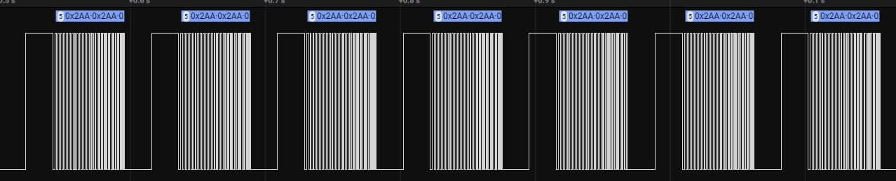
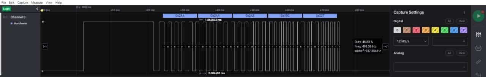

# RF library for SunBell Curtrains

I have 4 Sunbell curtains, that work on 433Mhz and I want to integrate them in my domotic system.  
  
The logic samples show this kind of encoding, which I suppose to be Manchester.  
  
Probably the message is composed by:  

||||||  
| ------------ | ------------ | ------------ | ------------ | ------------ |  
| Preamble | Transmitter address or sync | Target Id | Command | Checksum |

After some decoding attemps, i decided to simply retransmit the sampled signal.  
The sampled signal I used for each of the 4 channels is:   
automatic up: will open the curtrain  
automatic down: will close the curtrain  
fine up: while sent will slowly open the curtrain, or regulate inclination  
fine down: while sent will slowly close the curtrain, or regulate inclination  
stop: will stop automatic up or automatic down.  

| To use the library it's needed to |  
|-----------------|---------------|  
| define RF_TX pin  | #define RX_TX 2 |  
| define the channel needed  |  #define CHANNELx |  
| (optional)to compile only automatic up/down | #define RF_MINIMAL | 

# rfsend(n)

|n |  MEANING
| ------------ | ------------ |
| 1 |  channel 1 automatic-up
| 2 | channel 1 automatic-down
 |3 |channel 1 fine-up
 |4 |  channel 1 fine-down
 |5 |  channel 1 stop
 |6 | channel 2 automatic-up
 |7 |  channel 2 automatic-down
 |8 |  channel 2 fine-up
 |9 |  channel 2 fine-down
 |10|  channel 2 stop
 |11|  channel 3 automatic-up
 |12| channel 3 automatic-down
 |13|  channel 3 fine-up
 |14| channel 3 fine-down
 |15|  channel 3 stop
 |16|  channel 4 automatic-up
 |17|  channel 4 automatic-down
 |18|  channel 4 fine-up
 |19|  channel 4 fine-down
 |20|  channel 4 stop


## Example
```c
//define rf transmitter pin
#define RF_TX 2

//define needed channels
#define RF_CHANNEL1
#define RF_CHANNEL2
#define RF_CHANNEL3
#define RF_CHANNEL4

//define if you need only automatic up/down
#define RF_MINIMAL

//include the library
#include "custom_rf_complete.h"

#define RESEND 20

void setup() {
  //set rf transmitter pin as output
  pinMode(RF_TX, OUTPUT);
  //led go brrrr
  pinMode(LED_BUILTIN, OUTPUT);
}

void loop() {
  //will send the code RESEND times (original 5)
  for(int i=0; i<RESEND;i++){
    rfsend(2); //channel 1 automatic-down!!!
  }
  digitalWrite(LED_BUILTIN, HIGH);
  delay(3000);
  digitalWrite(LED_BUILTIN, LOW);
}
```
### FAQ
1) Can I use for... Sure  
2) Will it work on my curtrains? Yes, push both buttons on the reciever and send a command for the choosen channel.   N.B. this will exclude your remote  
3) But I want to use my remote!!! Ok, you can, sample your remote. You can convert .csv file to arduino code importing it in excelmodule.xlsx

  To Radaelli, I'm really impressed, the quality of the PCB it's astonishing! 